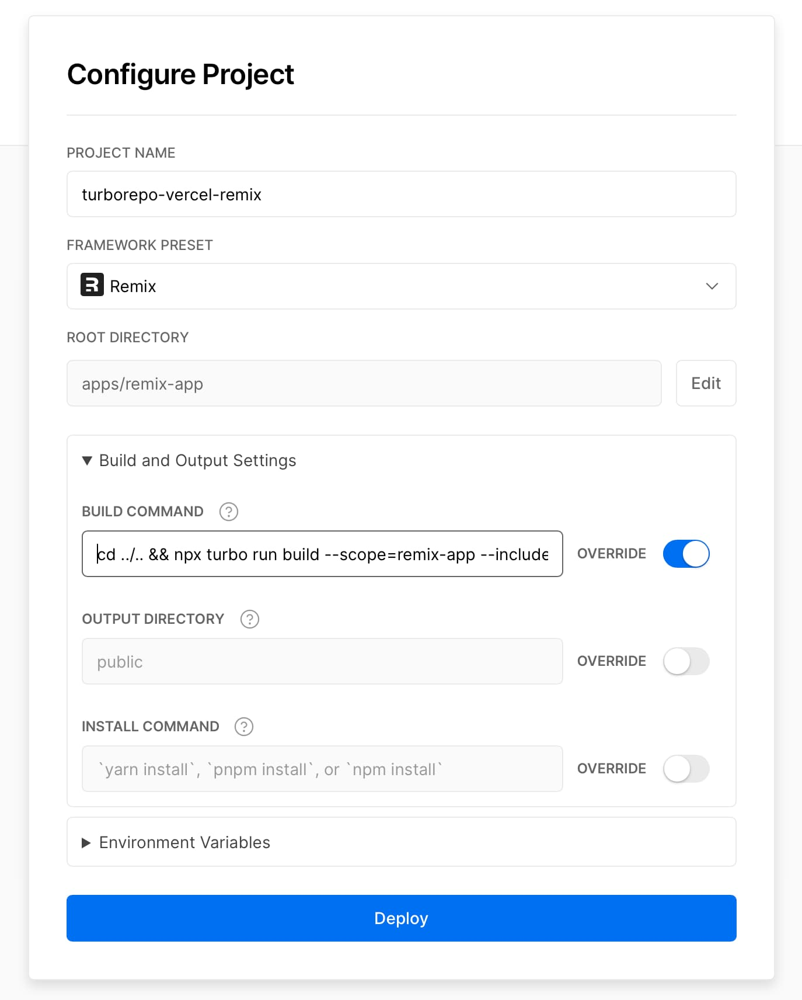

# Remix Turborepo Vercel

Example of setting up a Remix app that will be deployed to Vercel from inside a Turborepo monorepo.

## Preview

Open this example on [CodeSandbox](https://codesandbox.com):

<!-- TODO: update this link to the path for your example: -->

## Example

In order for this to work, your Vercel config should look like this:

